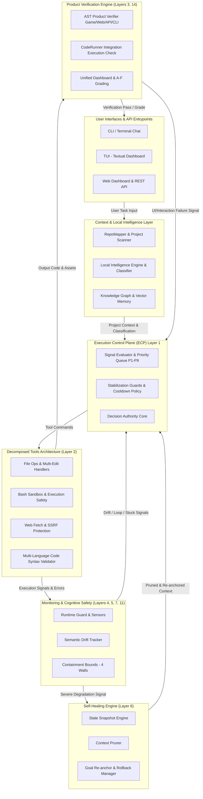
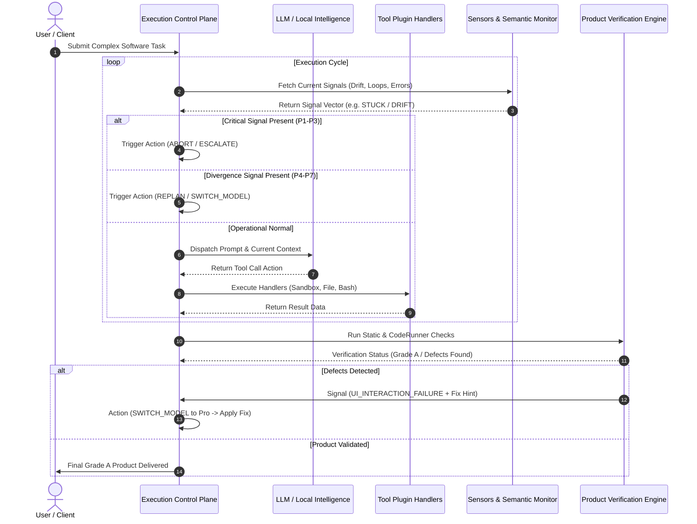
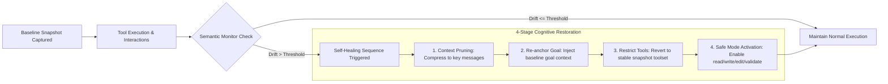

# WIDDX Nexus

[](LICENSE)
[](pyproject.toml)
[](https://github.com/widdx1990/widdx-cli-light)
[](https://github.com/widdx1990/widdx-cli-light/actions/workflows/ci.yml)
[](docs/reports/PROJECT-COMPARISON.md)

> **Layered cognitive runtime for autonomous engineering** — a tool-calling agent under a single decision authority, with semantic stability monitoring, self-healing, and domain-specific output verification.

Created with 🇵🇸 by **[MUHAMMAD MUSLIH](https://widdx.com)** — Founder & CEO of WIDDX

---

## Table of Contents

- [What is WIDDX Nexus?](#what-is-widdx-nexus)
- [WIDDX Nexus vs Devin & Competitors](#widdx-nexus-vs-devin--competitors)
- [Architecture — Runtime Layers](#architecture--runtime-layers)
- [System Architecture Flowchart (Mermaid)](#system-architecture-flowchart-mermaid)
- [Execution Control Plane (ECP) & Sequence Diagram](#execution-control-plane-ecp--sequence-diagram)
- [Self-Healing & Semantic Stability Engine](#self-healing--semantic-stability-engine)
- [Product Verification Engine](#product-verification-engine)
- [Decomposed Tool Plugin Architecture](#decomposed-tool-plugin-architecture)
- [Quick Start & Installation](#quick-start--installation)
- [Provider Setup](#provider-setup)
- [Development & Testing](#development--testing)
- [License](#license)

---

## What is WIDDX Nexus?

WIDDX Nexus is **not a passive chatbot**. It is a **layered cognitive runtime for autonomous software engineering**, built around a real tool-calling agent loop with explicit control, monitoring, and verification layers.

Each runtime layer below is wired into the agent loop and exercised by the test suite (873 passing). Scores reflect measured behaviour, not aspiration: layers that are advisory (MCL, CTI) report on constraint health without changing execution, and the self-reported autonomy level is **3.5** — tool-calling with verification and recovery, not unsupervised multi-session autonomy.

### Core Pillars

- **Execution Control Plane (ECP)**: Single decision authority with 5 control actions and 9 signal priority queues.
- **Closed-Loop Semantic Stability**: Monitors goal drift, trajectory divergence, and context contamination in real-time.
- **Self-Healing Engine**: Automatic context pruning, snapshotting, step-rollback, and re-anchoring when context degrades.
- **Product Verification Engine**: Domain-specific static & runtime checkers (Game, Web, API, CLI) verifying product output quality before completion.
- **Local Intelligence Engine**: Zero-LLM fallback classifier, rule evaluator, and pattern matcher ensuring high performance without unnecessary API calls.
- **Containment Bounds**: 4 strict mathematical boundaries (Drift, Invariance, Lyapunov convergence, SPC).
- **Execution Auditability**: A replay engine records every step, signal, and decision with a checksum; `/replay` lists, replays, and verifies recorded runs.

---

## WIDDX Nexus vs Devin & Competitors

This table compares **WIDDX Nexus** against general categories of AI coding tools. Scores are self-assessed against the 0–5 autonomy scale defined in `core/runtime/autonomy_metric.py`, not independently benchmarked.

| Feature / Dimension | **WIDDX Nexus** | Commercial cloud agents | IDE / terminal assistants |
| :--- | :--- | :--- | :--- |
| **System Architecture** | **13 runtime layers** (see below) with a single decision authority | Usually one agent loop with tool calling | Prompt + tool loop |
| **Decision Authority** | **ECP** — one authority, 5 actions, 9 priority signal queues | Model picks the next tool freely | User picks the action |
| **Semantic Drift Monitoring** | **Measured per step** — goal drift, trajectory divergence, context contamination | Rarely surfaced | Not surfaced |
| **Self-Healing Mechanics** | **Snapshot → prune → rollback → re-anchor**, verified by the invariance layer | Retry / restart | Manual retry |
| **Containment & Safety** | **4 measured bounds** (Drift, Invariance, Lyapunov, SPC) fed from live signals | Timeouts + sandbox | Permission prompts |
| **Product Verification** | **AST + runtime verifiers** (Game, Web, API, CLI) before declaring done | Build/test output | User inspection |
| **Offline / Local Routing** | **Local classifier + rule engine** (no LLM needed to route tasks) | Cloud-only | Cloud-only |
| **Providers** | **OpenCode Zen, DeepSeek, Ollama, GGUF, OpenAI-compatible** | Proprietary | Subscription API keys |
| **Execution Auditability** | **Replay engine** — recorded signals + decision diffs, `/replay` CLI | Session logs | Terminal scrollback |
| **Autonomy Level (self-assessed)** | **3.5** | ~4.0 | ~3.0 |

---

## Architecture — Runtime Layers

WIDDX Nexus is organized into **13 runtime layers** plus the tool plugin engine. The "Role" column states what each layer actually does in the agent loop; the "Wired" column records whether its values reach a control decision, feed metrics only, or are advisory:

| # | Layer | Role in the agent loop | Wired |
|:-:| :--- | :--- | :-:|
| **1** | **Execution Control Plane (ECP)** | Sole decision authority: `CONTINUE`, `REPLAN`, `SWITCH_MODEL`, `ESCALATE`, `ABORT` from P1–P9 signal queues | **Control** |
| **2** | **Tools Plugin Engine** | Decomposed handlers providing 37+ file, execution, web, and validation tools | **Execution** |
| **3** | **Benchmarks & Grading** | Traces every control decision; scores sessions into a letter grade | **Metrics** |
| **4** | **Signal Sensors** | Runtime guard, execution intelligence, and state controller feed signals into ECP | **Control** |
| **5** | **Semantic Stability** | Per-step goal-drift, trajectory-divergence, and context-contamination measurement | **Control** |
| **6** | **Self-Healing Engine** | Snapshot → prune → rollback → re-anchor, verified by the invariance layer | **Control** |
| **7** | **Invariance System** | 7 invariants + recovery contracts; its pass ratio feeds Containment every step | **Control** |
| **8** | **Adaptive Policy Engine** | Evidence-weighted parameter proposals with audit trail | **Metrics** |
| **9** | **Counterfactual Experiments** | A/B hypothesis runner with confidence intervals | **Metrics** |
| **10** | **Meta-Learning** | Lyapunov convergence monitoring; its `V(θ)` feeds Containment every step | **Control** |
| **11** | **Containment System** | 4 bounds (Drift, Invariance, Lyapunov, SPC) evaluated from live measurements; violations emit ECP signals | **Control** |
| **12** | **Constraint Reflexivity (MCL)** | Per-step constraint-health recording; produces a rigidity/suppression report for review | **Advisory** |
| **13** | **Constraint Transparency Index (CTI)** | Tracks how much potential learning constraints blocked; grades transparency A–F | **Advisory** |
| **14** | **Unified Dashboard** | Aggregates all layers into one health snapshot with an overall grade | **Metrics** |

**Control** = can change agent behaviour · **Metrics** = recorded and reported · **Advisory** = observed and reported, does not alter execution

---

## System Architecture Flowchart (Mermaid)

The overall flow of data, control signals, and feedback loops across the WIDDX Nexus Operating System is illustrated below:



---

## Execution Control Plane (ECP) & Sequence Diagram

The **Execution Control Plane (ECP)** sits directly inside the core agent loop. Before every LLM call and immediately following tool execution, the ECP evaluates incoming signals against priority rules to make deterministic operational decisions.

### 5 Control Actions

1. **`CONTINUE`**: Execution proceeds normally with the default strategy.
2. **`REPLAN`**: Re-analyzes current state and generates a fresh execution plan mid-task (Triggered by `STUCK` or `LOOP_DETECTED`).
3. **`SWITCH_MODEL`**: Instantly changes model tier (e.g., Flash $\leftrightarrow$ Pro, or OpenCode Zen $\rightarrow$ DeepSeek) when facing high error rates or quality degradation.
4. **`ESCALATE`**: Hands off control to the 8-role `ExpertTeam` pipeline when complexity or deadlock exceeds single-agent bounds.
5. **`ABORT`**: Gracefully and safely halts execution when safety boundaries or token limits are violated.

### Priority Queue (P1 -> P9)

```
P1: Critical Safety Breaches / Abort Flags   --> ABORT
P2: Memory & Token Pressure Bounds           --> ABORT
P3: Unrecoverable Execution Deadlock          --> ESCALATE
P4: Infinite Execution Loop Detected         --> REPLAN
P5: Agent Execution Stuck                    --> REPLAN / ESCALATE
P6: Tool Failure Rate >= 50%                 --> SWITCH_MODEL (Flash -> Pro)
P7: Output Quality Degradation               --> SWITCH_MODEL
P8: Complexity Drift >= 70%                  --> ESCALATE
P9: Token Efficiency Threshold               --> SWITCH_MODEL (Pro -> Flash)
```

### ECP Interactive Sequence Flow (Mermaid)



---

## Self-Healing & Semantic Stability Engine

When context bloats, goal drift occurs, or tool pollution sets in, WIDDX Nexus activates its **Cognitive State Restoration Engine**:



---

## Product Verification Engine

WIDDX Nexus evaluates final output through specialized verifiers before reporting completion, so defects are surfaced while they can still be fixed:

```
                  +-----------------------------------+
                  |   Agent Generates Game / Web App  |
                  +-----------------+-----------------+
                                    |
                                    v
                  +-----------------------------------+
                  |  Domain Verifier AST Analysis     |
                  +-----------------+-----------------+
                                    |
                     +--------------+--------------+
                     |                             |
                     v                             v
           [ Defect Detected ]           [ Zero Defects Found ]
           Double-jump bug, boundary             |
           or HTML syntax error                  v
                     |                    +------------------+
                     v                    | Deliver Product  |
           [ Signal Sent to ECP ]         |     Grade A      |
           UI_INTERACTION_FAILURE         +------------------+
                     |
                     v
           [ ECP Action Applied ]
           SWITCH_MODEL (Pro) + Fix Hint
```

### Verifier Matrix

- **GameVerifier**: Validates boundary mechanics, sprite collisions, key repeat handling, double-jump mechanics, and canvas scaling.
- **WebVerifier**: Checks HTML5 DOCTYPE validity, asset links, DOM structure, CSS binding, and multi-file imports.
- **APIVerifier**: Runs route inspection, HTTP status schemas, CORS headers, and input parameter handling.
- **CLIVerifier**: Assesses exit code compliance, STDOUT/STDERR formatting, and parameter parsing.

---

## Decomposed Tool Plugin Architecture

Split across a dispatcher core and **23 handler modules** exposing **37 tools**:

```
core/tools/
├── __init__.py           # Public API entrypoint
├── registry.py           # Tool definition registry
├── dispatch.py           # Unified tool execution dispatcher
├── safety.py             # Sandbox path & permission validation
├── registration.py       # Native tool registration definitions
└── handlers/
    ├── file_ops.py       # File reading, writing, searching, globbing
    ├── edit_files.py     # Multi-file atomic pattern editing
    ├── bash.py           # Secure subprocess execution
    ├── web.py            # SSRF-protected web fetching & browser
    ├── validate.py       # Multi-language AST syntax validator
    ├── spawn.py          # Sub-agent orchestration spawning
    ├── linter.py         # Multi-language linter integration
    ├── terminal_mux.py   # Long-running terminal sessions
    ├── db_query.py       # SQLite queries
    ├── api_client.py     # HTTP requests
    ├── docker_mgr.py     # Docker container/image inspection
    ├── pkg_mgr.py        # Package install/remove
    ├── semantic_search.py, dep_graph.py, rename.py
    ├── scaffold.py, security_scan.py, test_runner.py
    └── embeddings.py, ask_user.py, file_tree.py
```

---

## Quick Start & Installation

### Option 1: Install via pip

```bash
pip install git+https://github.com/widdx1990/widdx-cli-light.git
```

### Option 2: Install from source

```bash
git clone https://github.com/widdx1990/widdx-cli-light.git
cd widdx-cli-light
pip install -e .
```

The dashboard and REST API require the `api` extra. From a source checkout:

```bash
python -m pip install -e ".[api]"
```

### Launch Modes

```bash
# Terminal Chat CLI
widdx

# Terminal User Interface (TUI powered by Textual)
widdx-tui

# Web Dashboard (FastAPI) -> http://localhost:8000
widdx-web

# REST API Server
widdx-api --port 8001
```

Useful CLI commands: `/provider` (switch backend), `/apikey` (store a key), `/doctor` (environment check), `/replay` (inspect recorded runs), `/permissions` (sandbox level).

### Docker and nginx

```bash
docker build -t widdx/nexus:latest .
docker run -d --name widdx-web -p 8000:8000 widdx/nexus:latest
docker run -d --name widdx-api -p 8001:8000 --entrypoint widdx-api -e WIDDX_API_HOST=0.0.0.0 -e WIDDX_API_KEY -e WIDDX_PROVIDER_NAME widdx/nexus:latest --port 8000
```

The API example passes credentials/provider settings from your shell, overrides the web entrypoint, and keeps container port 8000 for the image health check. Set `WIDDX_API_KEY` and your provider environment variables before running it.

Include `deploy/nginx.conf` inside nginx's `http` context (as with `sites-enabled`), configure the hostname and certificate paths, then run `nginx -t` before reloading. Dashboard `/api/` requests go to the web backend on port 8000. `/standalone-api/` goes to the standalone backend on port 8001, rewriting that prefix to `/api/` (for example, `/standalone-api/health` becomes `/api/health`). Standalone `/docs`, `/openapi.json`, and `/metrics` are not exposed by this prefix.

The root `widdx_web` module and its adjacent `widdx-dashboard.html` resource are explicitly packaged, alongside `scripts/static` assets. The current `.dockerignore` excludes SVG files, so Docker builds omit the favicon unless that separate file is adjusted.

---

## Provider Setup

WIDDX Nexus ships with automated failover across these backends:

| Provider | Type | API Key Required? | Notes |
| :--- | :--- | :---: | :--- |
| **OpenCode Zen** | Cloud | No | **Default provider.** Free tier; availability is rate-limited and models rotate. |
| **DeepSeek** | Cloud | Yes | Reliable paid option; the most dependable backend for sustained work. |
| **Ollama** | Local | No | Fully offline. Requires Ollama installed and a model pulled. |
| **GGUF Direct** | Local | No | Runs quantized GGUF models in-process; requires `llama-cpp-python` (`pip install ".[gguf]"`). |
| **OpenAI-compatible** | Cloud | Usually | Any endpoint implementing the OpenAI chat-completions API. |

> **Note on free access:** OpenCode Zen free-model availability depends on upstream quotas. If the Zen endpoint rejects a request, the reliability layer fails over automatically; for sustained use, configure a paid key with `/apikey`.

---

## Development & Testing

Install the same development and API dependencies used by CI, including Ruff, mypy, request type stubs, and PyYAML:

```bash
python -m pip install -e ".[dev,api]"
python -m pytest tests/ -v --tb=short --cov=core --cov-report=xml
python -m ruff check core/ cli/ tui/ scripts/ --output-format=github
python -m mypy core/ --ignore-missing-imports --check-untyped-defs
```

Run the scoped deployment configuration checks and build distributions:

```bash
python -m pytest tests/test_k8s_manifests.py -q
python -m build
```

CI checks wheel contents for the web module, dashboard HTML, static assets, and TUI styles, then smoke-imports the installed package outside the checkout. Static nginx assertions do not replace `nginx -t` with your deployment certificates.

---

## License

This project is licensed under the **MIT License** — see the [LICENSE](LICENSE) file for details.

Created with 🇵🇸 by **[MUHAMMAD MUSLIH](https://widdx.com)** — Founder & CEO of WIDDX
